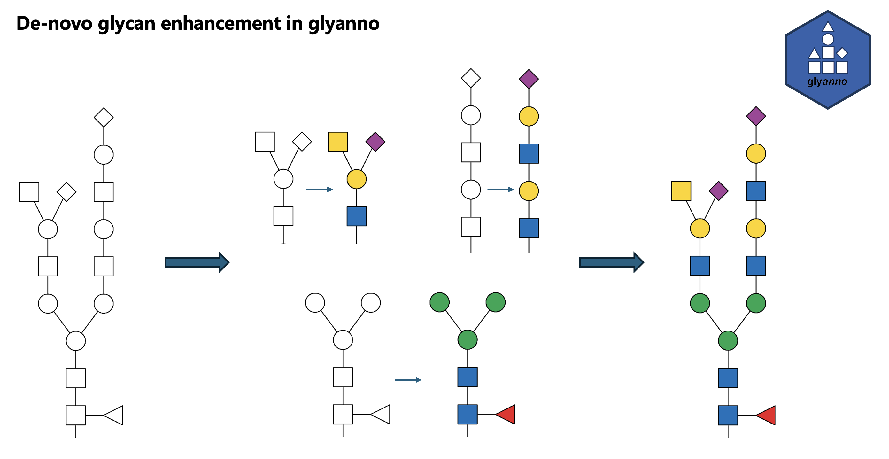

# Get Started with glyanno

## The Challenge

Mass spectrometry-based glycomics and glycoproteomics often yield data
with limited structural resolution. For example, MALDI-TOF MS-based
glycomics typically provides only m/z values, while many LC-MS/MS-based
glycoproteomics workflows identify basic glycan compositions but lack
isomer specificity. Mass spectrometry alone frequently fails to
distinguish specific monosaccharide isomers (e.g., differentiating
Mannose from Galactose), or resolve linkage details (e.g., a1-3 vs
b1-4).

In theory, full structural resolution is achievable by combining MS with
orthogonal techniques such as enzymatic digestion or NMR; however, these
approaches are often resource-intensive and time-consuming.
Unfortunately, advanced downstream analyses—such as the glycan
biosynthetic pathway reconstruction offered by
[glyenzy](https://github.com/glycoverse/glyenzy)— require fully resolved
glycan structures, including specific monosaccharide identities and
linkage information.

## What is glyanno?

`glyanno` bridges this gap. This package is designed to maximize the
utility of your mass spectrometry data by annotating it with probable
biological context derived from knowledge bases. The package features
four core functions:

- [`mz_to_comp()`](https://glycoverse.github.io/glyanno/dev/reference/mz_to_comp.md):
  Identifies possible glycan compositions from m/z values.
- [`comp_to_struc()`](https://glycoverse.github.io/glyanno/dev/reference/comp_to_struc.md):
  Maps glycan compositions to potential glycan structures.
- [`enhance_comp()`](https://glycoverse.github.io/glyanno/dev/reference/enhance_comp.md):
  Refines generic glycan compositions into concrete,
  monosaccharide-specific compositions.
- [`enhance_struc()`](https://glycoverse.github.io/glyanno/dev/reference/enhance_struc.md):
  Resolves low-resolution glycan structures into high-resolution
  structures with linkage information.


``` r

library(glyanno)
library(glydb)
#> 
#> Attaching package: 'glydb'
#> The following object is masked from 'package:glyanno':
#> 
#>     struc_to_glytoucan
```

**Note:** This package relies on
[glyrepr](https://github.com/glycoverse/glyrepr) and
[glydb](https://github.com/glycoverse/glydb). We recommend familiarizing
yourself with these packages, especially `glyrepr`, before using
`glyanno`. Additionally, a basic understanding of IUPAC-condensed
notation is recommended for this vignette. You can refer to this
[tutorial](https://glycoverse.github.io/glyrepr/articles/iupac.html).

## Workflow: M/z -\> Composition -\> Structure

Let’s demonstrate these functions step-by-step, starting with a single
m/z value.

``` r

mz_to_comp(406.1325, charge = 1, adduct = "Na+")
#> # A tibble: 7 × 3
#>      mz composition       confidence
#>   <dbl> <glydb_cm>             <dbl>
#> 1  406. Gal(1)GalNAc(1)        5.32 
#> 2  406. Gal(1)GlcNAc(1)        2.71 
#> 3  406. Glc(1)GlcNAc(1)        0.693
#> 4  406. Man(1)GlcNAc(1)        2.08 
#> 5  406. GalNAc(1)L-Gal(1)     -1    
#> 6  406. GalNAc(1)Galf(1)      -1    
#> 7  406. GlcNAc(1)Galf(1)      -1
```

This returns every composition in `glydb` matching the m/z of 406.1325.
In practice, returning “all” possibilities can be overwhelming; you will
often want to constrain the search space based on biological context.

The annotation functions accept filters for the built-in `glydb`
database. For example, you might want to limit the search to only human
O-GalNAc glycans.

``` r

mz_to_comp(406.1325, charge = 1, adduct = "Na+", species = "Homo sapiens", glycan_type = "O-GalNAc")
#> # A tibble: 1 × 3
#>      mz composition     confidence
#>   <dbl> <glydb_cm>           <dbl>
#> 1  406. Gal(1)GalNAc(1)       5.32
```

The results are now significantly more relevant to our specific context.

With the composition identified, we can proceed to determine potential
structures. The m/z value 406.1325 corresponds to the composition
Gal(1)GalNAc(1). What are the possible structures for this composition?

``` r

comp_to_struc("Gal(1)GalNAc(1)", species = "Homo sapiens", glycan_type = "O-GalNAc")
#> Warning: `db` contains 9 structures with unresolved floating parts or substituents.
#> ℹ Those database structures were excluded from matching.
#> # A tibble: 3 × 3
#>   composition     structure           confidence
#>   <comp>          <glydb_st>               <dbl>
#> 1 Gal(1)GalNAc(1) Gal(b1-3)GalNAc(a1-       5.32
#> 2 Gal(1)GalNAc(1) Gal(b1-3)GalNAc(b1-       1.10
#> 3 Gal(1)GalNAc(1) Gal(a1-3)GalNAc(a1-       1.61
```

[`comp_to_struc()`](https://glycoverse.github.io/glyanno/dev/reference/comp_to_struc.md)
selects structures from `glydb` using the same filters.

Two structures are possible, one is Core 1, the other is Core 5.
Sometimes we just want a “most possible” result. In this case, you can
set `return_best` to `TRUE`:

``` r

comp_to_struc("Gal(1)GalNAc(1)", species = "Homo sapiens", glycan_type = "O-GalNAc", return_best = TRUE)
#> Warning: `db` contains 9 structures with unresolved floating parts or substituents.
#> ℹ Those database structures were excluded from matching.
#> <glydb_structure[1]>
#> [1] Gal(b1-3)GalNAc(a1-
#> # Unique structures: 1
```

Core 1 is more common than Core 5, so it was kept. The function keeps
the structure with most citations for multiple matches.

Note that when `return_best = TRUE`, the function returns a vector with
the same length of the input instead of a tibble. When a glycan has no
matches, `<NA>` will be on the corresponding position.

Note that all functions in `glyanno` works vectorizedly:

``` r

comp_to_struc(c("Gal(1)GalNAc(1)", "GlcNAc(1)GalNAc(1)"), species = "Homo sapiens", glycan_type = "O-GalNAc", return_best = TRUE)
#> Warning: `db` contains 9 structures with unresolved floating parts or substituents.
#> ℹ Those database structures were excluded from matching.
#> <glydb_structure[2]>
#> [1] Gal(b1-3)GalNAc(a1-
#> [2] GlcNAc(b1-3)GalNAc(a1-
#> # Unique structures: 2
```

If you set `return_best` to `TRUE`, the function directly returns a
vector:

``` r

comp_to_struc(c("Gal(1)GalNAc(1)", "GlcNAc(1)GalNAc(1)"), species = "Homo sapiens", glycan_type = "O-GalNAc", return_best = TRUE)
#> Warning: `db` contains 9 structures with unresolved floating parts or substituents.
#> ℹ Those database structures were excluded from matching.
#> <glydb_structure[2]>
#> [1] Gal(b1-3)GalNAc(a1-
#> [2] GlcNAc(b1-3)GalNAc(a1-
#> # Unique structures: 2
```

This vector always has the same length as the input, with `NA` for
glycans with no match.

You can also set the structure level used for matching. For example, it
is possible to use a database with only topology-level structures
without linkage information.

``` r

comp_to_struc(
  c("Gal(1)GalNAc(1)", "GlcNAc(1)GalNAc(1)"),
  structure_level = "topological",
  species = "Homo sapiens",
  glycan_type = "O-GalNAc"
)
#> Warning: `db` contains 74 structures with unresolved floating parts or substituents.
#> ℹ Those database structures were excluded from matching.
#> # A tibble: 4 × 3
#>   composition        structure                 confidence
#>   <comp>             <glydb_st>                     <dbl>
#> 1 Gal(1)GalNAc(1)    Gal(??-?)GalNAc(??-             5.32
#> 2 Gal(1)GalNAc(1)    Gal(??-?)GalNAc-ol(??-          3.22
#> 3 GlcNAc(1)GalNAc(1) GlcNAc(??-?)GalNAc(??-          2.77
#> 4 GlcNAc(1)GalNAc(1) GlcNAc(??-?)GalNAc-ol(??-       2.40
```

## Enhancing Compositions and Structures

Researchers often need to refine generic annotations into more specific
ones. For instance, you may wish to convert generic compositions into
specific monosaccharide lists, or assign potential linkages to a
topology-only structure.
[`enhance_comp()`](https://glycoverse.github.io/glyanno/dev/reference/enhance_comp.md)
and
[`enhance_struc()`](https://glycoverse.github.io/glyanno/dev/reference/enhance_struc.md)
are designed for this purpose.

Both functions return a tibble with two columns: `raw` (the original
input) and `enhanced` (the potential high-resolution candidates).

``` r

enhance_comp("Hex(1)HexNAc(1)")
#> # A tibble: 7 × 3
#>   raw             enhanced          confidence
#>   <comp>          <glydb_cm>             <dbl>
#> 1 Hex(1)HexNAc(1) Gal(1)GalNAc(1)        5.32 
#> 2 Hex(1)HexNAc(1) Gal(1)GlcNAc(1)        2.71 
#> 3 Hex(1)HexNAc(1) Glc(1)GlcNAc(1)        0.693
#> 4 Hex(1)HexNAc(1) Man(1)GlcNAc(1)        2.08 
#> 5 Hex(1)HexNAc(1) GalNAc(1)L-Gal(1)     -1    
#> 6 Hex(1)HexNAc(1) GalNAc(1)Galf(1)      -1    
#> 7 Hex(1)HexNAc(1) GlcNAc(1)Galf(1)      -1
```

``` r

enhance_struc("Gal(??-?)GalNAc(??-")
#> Warning: `db` contains 564 structures with unresolved floating parts or substituents.
#> ℹ Those database structures were excluded from matching.
#> # A tibble: 9 × 3
#>   raw                 enhanced            confidence
#>   <struct>            <glydb_st>               <dbl>
#> 1 Gal(??-?)GalNAc(??- Gal(b1-3)GalNAc(a1-       5.32
#> 2 Gal(??-?)GalNAc(??- Gal(a1-3)GalNAc(b1-      -1   
#> 3 Gal(??-?)GalNAc(??- Gal(b1-3)GalNAc(b1-       1.10
#> 4 Gal(??-?)GalNAc(??- Gal(b1-4)GalNAc(b1-      -1   
#> 5 Gal(??-?)GalNAc(??- Gal(a1-6)GalNAc(a1-      -1   
#> 6 Gal(??-?)GalNAc(??- Gal(b1-6)GalNAc(a1-      -1   
#> 7 Gal(??-?)GalNAc(??- Gal(b1-6)GalNAc(b1-      -1   
#> 8 Gal(??-?)GalNAc(??- Gal(a1-3)GalNAc(a1-       1.61
#> 9 Gal(??-?)GalNAc(??- Gal(b1-4)GalNAc(a1-      -1
```

Similarly, filters narrow down results to biologically relevant
candidates.

``` r

enhance_comp("Hex(1)HexNAc(1)", species = "Homo sapiens", glycan_type = "O-GalNAc")
#> # A tibble: 1 × 3
#>   raw             enhanced        confidence
#>   <comp>          <glydb_cm>           <dbl>
#> 1 Hex(1)HexNAc(1) Gal(1)GalNAc(1)       5.32
```

``` r

enhance_struc("Gal(??-?)GalNAc(??-", species = "Homo sapiens", glycan_type = "O-GalNAc")
#> Warning: `db` contains 9 structures with unresolved floating parts or substituents.
#> ℹ Those database structures were excluded from matching.
#> # A tibble: 3 × 3
#>   raw                 enhanced            confidence
#>   <struct>            <glydb_st>               <dbl>
#> 1 Gal(??-?)GalNAc(??- Gal(b1-3)GalNAc(a1-       5.32
#> 2 Gal(??-?)GalNAc(??- Gal(b1-3)GalNAc(b1-       1.10
#> 3 Gal(??-?)GalNAc(??- Gal(a1-3)GalNAc(a1-       1.61
```

You can set `return_best` to `TRUE` as well.

``` r

enhance_struc(
  "Gal(??-?)GalNAc(??-",
  species = "Homo sapiens",
  glycan_type = "O-GalNAc",
  return_best = TRUE
)
#> Warning: `db` contains 9 structures with unresolved floating parts or substituents.
#> ℹ Those database structures were excluded from matching.
#> <glycan_structure[1]>
#> [1] Gal(b1-3)GalNAc(a1-
#> # Unique structures: 1
```

## De novo enhancement of N-glycans

N-glycans have many possible branching patterns, but databases of human-
detected glycans cover only a fraction of this potential structure
space.
[`enhance_struc_denovo()`](https://glycoverse.github.io/glyanno/dev/reference/enhance_struc_denovo.md)
reconstructs generic topological N-glycans from their conserved core and
branches, returning one concrete topological candidate per input. It
preserves optional core fucose and bisecting GlcNAc residues. Inputs
that cannot be reconstructed are matched against a topological fallback
database.



``` r

glycan <- "NeuAc(??-?)Hex(??-?)HexNAc(??-?)Hex(??-?)HexNAc(??-?)Hex(??-?)[HexNAc(??-?)[NeuAc(??-?)]Hex(??-?)HexNAc(??-?)Hex(??-?)]Hex(??-?)HexNAc(??-?)[dHex(??-?)]HexNAc(??-"
enhance_struc_denovo(glycan)
#> <glycan_structure[1]>
#> [1] Neu5Ac(??-?)Gal(??-?)GlcNAc(??-?)Gal(??-?)GlcNAc(??-?)Man(??-?)[Neu5Ac(??-?)[GalNAc(??-?)]Gal(??-?)GlcNAc(??-?)Man(??-?)]Man(??-?)GlcNAc(??-?)[Fuc(??-?)]GlcNAc(??-
#> # Unique structures: 1
```

All non-missing inputs to
[`enhance_struc_denovo()`](https://glycoverse.github.io/glyanno/dev/reference/enhance_struc_denovo.md)
must contain only generic residues and must be topological. Missing
values are allowed and preserved.

## Bidirectional Conversion

While `glyanno` focuses on inferring high-resolution information from
low-resolution data, the `glycoverse` ecosystem also provides
complementary functions to perform the reverse operations—simplifying
detailed structures back to their lower-resolution representations.

A summary of these relationships:

| Enhance | Back |
|----|----|
| [`mz_to_comp()`](https://glycoverse.github.io/glyanno/dev/reference/mz_to_comp.md) | [`calculate_mz()`](https://glycoverse.github.io/glyanno/dev/reference/calculate_mz.md) |
| [`comp_to_struc()`](https://glycoverse.github.io/glyanno/dev/reference/comp_to_struc.md) | [`glyrepr::as_glycan_composition()`](https://glycoverse.github.io/glyrepr/reference/as_glycan_composition.html) |
| [`enhance_comp()`](https://glycoverse.github.io/glyanno/dev/reference/enhance_comp.md) | [`glyrepr::convert_to_generic()`](https://glycoverse.github.io/glyrepr/reference/convert_to_generic.html) |
| [`enhance_struc()`](https://glycoverse.github.io/glyanno/dev/reference/enhance_struc.md) | [`glyrepr::remove_linkages()`](https://glycoverse.github.io/glyrepr/reference/remove_linkages.html) and [`glyrepr::convert_to_generic()`](https://glycoverse.github.io/glyrepr/reference/convert_to_generic.html) |
