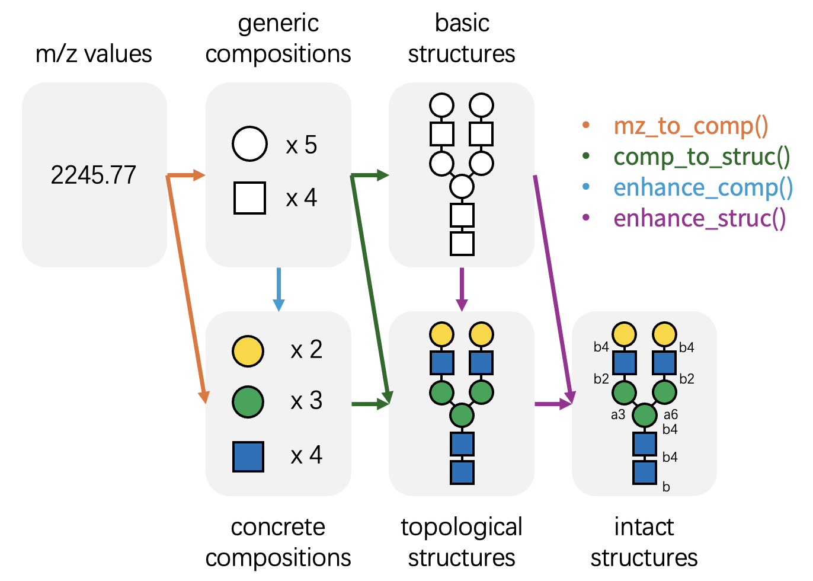
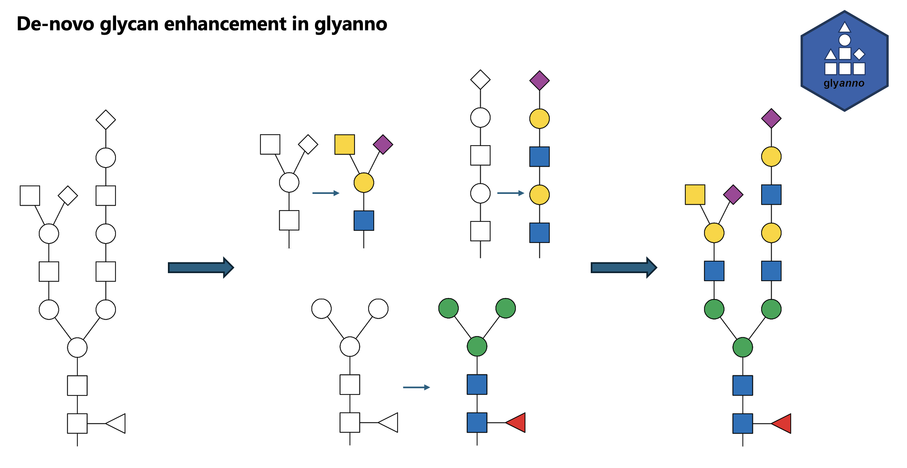

```{r, include = FALSE}
knitr::opts_chunk$set(
  collapse = TRUE,
  comment = "#>"
)
```

## The Challenge

Mass spectrometry-based glycomics and glycoproteomics often yield data with limited structural resolution.
For example, MALDI-TOF MS-based glycomics typically provides only m/z values,
while many LC-MS/MS-based glycoproteomics workflows identify basic glycan compositions but lack isomer specificity.
Mass spectrometry alone frequently fails to distinguish specific monosaccharide isomers (e.g., differentiating Mannose from Galactose),
or resolve linkage details (e.g., a1-3 vs b1-4).

In theory, full structural resolution is achievable by combining MS with orthogonal techniques such as enzymatic digestion or NMR;
however, these approaches are often resource-intensive and time-consuming.
Unfortunately, advanced downstream analyses—such as the glycan biosynthetic pathway reconstruction offered by [glyenzy](https://github.com/glycoverse/glyenzy)—
require fully resolved glycan structures, including specific monosaccharide identities and linkage information.

## What is glyanno?

`glyanno` bridges this gap.
This package is designed to maximize the utility of your mass spectrometry data by annotating it with probable biological context derived from knowledge bases.
The package features four core functions:

- `mz_to_comp()`: Identifies possible glycan compositions from m/z values.
- `comp_to_struc()`: Maps glycan compositions to potential glycan structures.
- `enhance_comp()`: Refines generic glycan compositions into concrete, monosaccharide-specific compositions.
- `enhance_struc()`: Resolves low-resolution glycan structures into high-resolution structures with linkage information.

{width=500}

```{r setup}
library(glyanno)
library(glydb)
```

**Note:** This package relies on [glyrepr](https://github.com/glycoverse/glyrepr) and [glydb](https://github.com/glycoverse/glydb).
We recommend familiarizing yourself with these packages, especially `glyrepr`, before using `glyanno`.
Additionally, a basic understanding of IUPAC-condensed notation is recommended for this vignette.
You can refer to this [tutorial](https://glycoverse.github.io/glyrepr/articles/iupac.html).

## Build the annotation cache

After installing or updating `glydb`, an interactive `library(glyanno)` call
reminds you to build the persistent annotation cache:

```r
build_glyanno_cache()
```

The build uses the installed `glydb` data and saves the result in
`tools::R_user_dir("glyanno", "cache")`, following the
[R Packages guidance on persistent user data](https://r-pkgs.org/data.html#sec-data-persistent).
Calling the build function again reuses the current cache. A changed `glydb`
version makes the cache outdated and triggers another reminder on attachment.
Annotation still works if you defer building: the needed views are prepared in
memory and discarded when R exits.

The cache contains:

| Data | Used for |
|---|---|
| Concrete and generic composition views | Composition enhancement and mass annotation |
| Four structure views: intact/topological × concrete/generic, including parsed graphs | Composition-to-structure and structure matching; de novo fallback |
| Exact and generic composition lookup groups, residue counts, and confidence ranks | Candidate selection and stable best-match selection |
| Species and glycan-type membership; concrete and generic counts | Database filtering without reprocessing structures |
| Floating-part/substituent flags | Excluding unsupported candidates with the existing warnings |
| Residue masses for six built-in dictionaries and counts for custom dictionaries | Mass annotation across derivatizations, mass types, charges, and adducts |
| Structure keys and GlyTouCan accessions | Local accession lookup |

All views come from `glydb`'s public getters. Their candidate order and confidence
scores are preserved, including when filters are combined. Query-specific graph
matching is still performed by `glymotif`; arbitrary user inputs cannot all be
precalculated. Custom databases supplied through the deprecated `db` argument
are not written to disk.

Use these commands to inspect, rebuild, or remove the cache:

```r
glyanno_cache_info()
build_glyanno_cache(force = TRUE)
clear_glyanno_cache()
```

A rebuild writes a complete replacement before replacing the previous file, so
an interrupted build preserves the previous cache. After validation, the old
file is moved to a temporary backup so replacement also works on Windows. A
failed replacement restores that backup; a successful replacement removes it.
Only one completed cache is kept. A directory lock prevents simultaneous writers. If a process is killed
and leaves a lock, the next build reports the lock's path for manual removal.

Cache inspection and package attachment read only a small metadata header and
check the file size. The compressed annotation data are loaded and validated
when annotation first needs them, then reused in the session. If the payload is
damaged while its header remains valid, use `build_glyanno_cache(force = TRUE)`
to repair it. Caches written in the previous format trigger a rebuild reminder.

For a different storage location, set `options(glyanno.cache_dir = "/your/path")`
before building or annotating. The cache also checks the representation and
graph-library versions, R major/minor version, collation locale, and its internal
schema to avoid reusing incompatible objects. Restart R after updating
dependencies. Development changes to `glydb` data without a version bump require
an explicit rebuild with `force = TRUE`.

## Workflow: M/z -> Composition -> Structure

Let's demonstrate these functions step-by-step,
starting with a single m/z value.

```{r}
mz_to_comp(406.1325, charge = 1, adduct = "Na+")
```

This returns every composition in `glydb` matching the m/z of 406.1325.
In practice, returning "all" possibilities can be overwhelming;
you will often want to constrain the search space based on biological context.

The annotation functions accept filters for the built-in `glydb` database.
For example, you might want to limit the search to only human O-GalNAc glycans.

```{r}
mz_to_comp(406.1325, charge = 1, adduct = "Na+", species = "Homo sapiens", glycan_type = "O-GalNAc")
```

The results are now significantly more relevant to our specific context.

With the composition identified, we can proceed to determine potential structures.
The m/z value 406.1325 corresponds to the composition Gal(1)GalNAc(1).
What are the possible structures for this composition?

```{r}
comp_to_struc("Gal(1)GalNAc(1)", species = "Homo sapiens", glycan_type = "O-GalNAc")
```

`comp_to_struc()` selects structures from `glydb` using the same filters.

Two structures are possible, one is Core 1, the other is Core 5.
Sometimes we just want a "most possible" result.
In this case, you can set `return_best` to `TRUE`:

```{r}
comp_to_struc("Gal(1)GalNAc(1)", species = "Homo sapiens", glycan_type = "O-GalNAc", return_best = TRUE)
```

Core 1 is more common than Core 5, so it was kept.
The function keeps the structure with most citations for multiple matches.

Note that when `return_best = TRUE`, the function returns a vector with the same length of the input instead of a tibble.
When a glycan has no matches, `<NA>` will be on the corresponding position.

Note that all functions in `glyanno` works vectorizedly:

```{r}
comp_to_struc(c("Gal(1)GalNAc(1)", "GlcNAc(1)GalNAc(1)"), species = "Homo sapiens", glycan_type = "O-GalNAc", return_best = TRUE)
```

If you set `return_best` to `TRUE`, the function directly returns a vector:

```{r}
comp_to_struc(c("Gal(1)GalNAc(1)", "GlcNAc(1)GalNAc(1)"), species = "Homo sapiens", glycan_type = "O-GalNAc", return_best = TRUE)
```

This vector always has the same length as the input, with `NA` for glycans with no match.

You can also set the structure level used for matching.
For example, it is possible to use a database with only topology-level structures without linkage information.

```{r}
comp_to_struc(
  c("Gal(1)GalNAc(1)", "GlcNAc(1)GalNAc(1)"),
  structure_level = "topological",
  species = "Homo sapiens",
  glycan_type = "O-GalNAc"
)
```

## Enhancing Compositions and Structures

Researchers often need to refine generic annotations into more specific ones.
For instance, you may wish to convert generic compositions into specific monosaccharide lists,
or assign potential linkages to a topology-only structure.
`enhance_comp()` and `enhance_struc()` are designed for this purpose.

Both functions return a tibble with two columns:
`raw` (the original input) and `enhanced` (the potential high-resolution candidates).

```{r}
enhance_comp("Hex(1)HexNAc(1)")
```

```{r}
enhance_struc("Gal(??-?)GalNAc(??-")
```

Similarly, filters narrow down results to biologically relevant candidates.

```{r}
enhance_comp("Hex(1)HexNAc(1)", species = "Homo sapiens", glycan_type = "O-GalNAc")
```

```{r}
enhance_struc("Gal(??-?)GalNAc(??-", species = "Homo sapiens", glycan_type = "O-GalNAc")
```

You can set `return_best` to `TRUE` as well.

```{r}
enhance_struc(
  "Gal(??-?)GalNAc(??-",
  species = "Homo sapiens",
  glycan_type = "O-GalNAc",
  return_best = TRUE
)
```

## De novo enhancement of N-glycans

N-glycans have many possible branching patterns, but databases of human-
detected glycans cover only a fraction of this potential structure space.
`enhance_struc_denovo()` reconstructs generic topological N-glycans from their
conserved core and branches, returning one concrete topological candidate per
input.
It preserves optional core fucose and bisecting GlcNAc residues.
Inputs that cannot be reconstructed are matched against a topological fallback database.



```{r}
glycan <- "NeuAc(??-?)Hex(??-?)HexNAc(??-?)Hex(??-?)HexNAc(??-?)Hex(??-?)[HexNAc(??-?)[NeuAc(??-?)]Hex(??-?)HexNAc(??-?)Hex(??-?)]Hex(??-?)HexNAc(??-?)[dHex(??-?)]HexNAc(??-"
enhance_struc_denovo(glycan)
```

All non-missing inputs to `enhance_struc_denovo()` must contain only generic
residues and must be topological. Missing values are allowed and preserved.

## Bidirectional Conversion

While `glyanno` focuses on inferring high-resolution information from low-resolution data,
the `glycoverse` ecosystem also provides complementary functions to perform the reverse operations—simplifying detailed structures back to their lower-resolution representations.

A summary of these relationships:

| Enhance | Back |
|---------|------|
| `mz_to_comp()` | `calculate_mz()` |
| `comp_to_struc()` | `glyrepr::as_glycan_composition()` |
| `enhance_comp()` | `glyrepr::convert_to_generic()` |
| `enhance_struc()` | `glyrepr::remove_linkages()` and `glyrepr::convert_to_generic()` |
